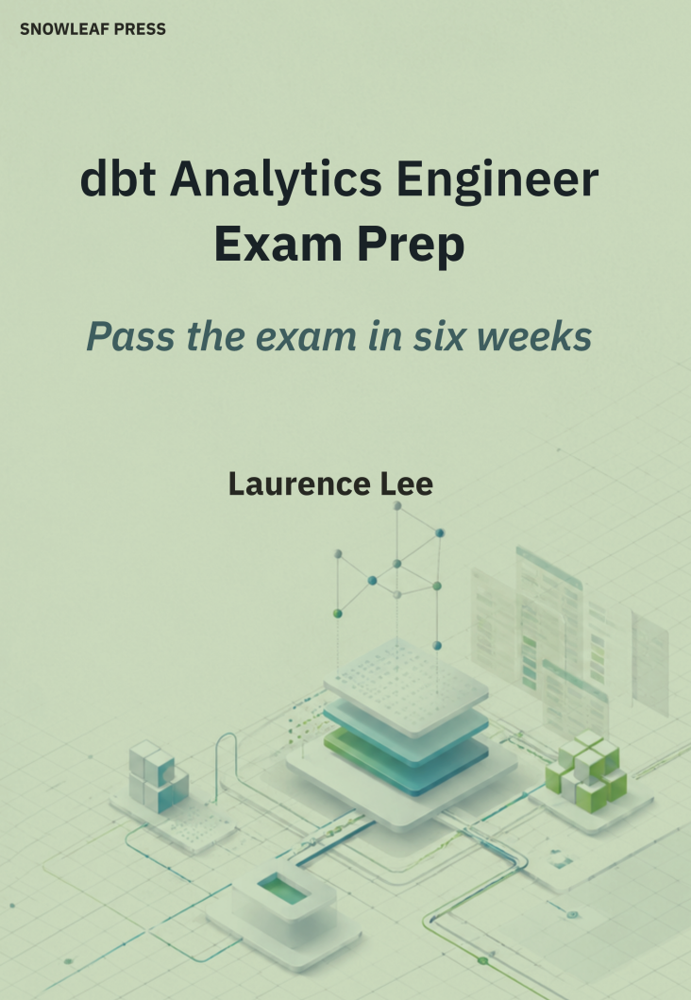

# dbt AE Certification — Hands-On Companion

> A runnable dbt 1.8 project on Postgres that exercises the exam patterns that translate to a local warehouse — sources, materializations, snapshots, tests (including native 1.8 unit tests), macros, packages, documentation, governance, contracts, grants, state/defer, and slim CI. Click *Reopen in Container*, run three commands, and you have **109 green nodes**. Warehouse-specific features the exam also lists (Python models, zero-copy clones, Delta / Unity Catalog) stay out of scope by design — see [*What this repo can't demonstrate*](#what-this-repo-cant-demonstrate).

<p>
  <a href="https://docs.getdbt.com/docs/dbt-versions/core-upgrade/upgrading-to-v1.8"></a>
  
  
  
  
  
  
</p>

[](https://github.com/codespaces/new/?quickstart=1&repo=snowleafpress%2Fdbt-analytics-engineer-certification)

---

## 📖 Companion to the book

This repo is the hands-on lab for **_dbt Analytics Engineer Exam Prep_** — the textbook side of the same material.

<table>
  <tr>
    <td width="240" valign="top">
      <a href="https://mybook.to/dbt-ae-exam-prep">
        
      </a>
    </td>
    <td valign="top">
      <p>Read the concepts, then run them here. The book covers every topic on the V.9.0 blueprint with worked examples; this repo lets you execute, break, and inspect them on a local Postgres warehouse.</p>
      <p>
        <a href="https://mybook.to/dbt-ae-exam-prep">
          
        </a>
      </p>
      <sub>The link auto-redirects to your local Amazon marketplace (US, UK, DE, FR, IT, ES, CA, AU, JP, IN, …).</sub>
    </td>
  </tr>
</table>

---

## Who is this for?

- **Candidates preparing for the dbt AE Certification (V.9.0)** who want to *run* the concepts, not just read about them
- **Engineers new to dbt** who want a complete, opinionated reference project — seeds, sources, staging/marts, snapshots, tests, docs, grants — all wired up and green
- **Instructors / team leads** building a training environment: every exam concept has a concrete, minimal example you can point at

This repo is a **lab**, not a tutorial. It's designed to be explored by running commands and reading diffs. Pair it with the [official dbt docs](https://docs.getdbt.com/docs) for the textbook side.

## What's in the box

| | |
|---:|---|
| **18** | models (6 views + 1 ephemeral + 6 tables + 4 incrementals + 1 materialized view) |
| **3** | incremental strategies (`append`, `delete+insert`, native `merge`) |
| **3** | snapshots (timestamp + check-cols + check-all) |
| **85** | data tests (generic + singular + custom generic) |
| **2** | unit tests (dbt 1.8 native `unit_tests:`) |
| **4** | Hub packages (dbt_utils, dbt_expectations, audit_helper, codegen) |
| **4** | constraint types on the contracted model (`not_null`, `unique`, `check`, `primary_key`) |
| **3** | exposures (dashboard + ml + analysis) |
| **12** | broken-example drills for triage practice |

Full concept-to-file mapping: **[REPO-COVERAGE.md](REPO-COVERAGE.md)**.

---

## Table of contents

- [Quickstart](#quickstart-2-minutes)
- [Your first 10 minutes](#your-first-10-minutes)
- [What's inside](#whats-inside)
- [Project layout](#project-layout)
- [Useful commands](#useful-commands-to-try)
- [Stack & version notes](#stack)
- [What this repo can't demonstrate](#what-this-repo-cant-demonstrate)
- [Troubleshooting](#troubleshooting)
- [Prerequisites](#prerequisites)
- [Contributing](#contributing)

---

## Prerequisites

Install these before you clone the repo — in this order:

1. **Docker Desktop** — [Windows](https://docs.docker.com/desktop/install/windows-install/) / [Mac](https://docs.docker.com/desktop/install/mac-install/) / on Linux use [Docker Engine](https://docs.docker.com/engine/install/) directly. During the Windows install, **enable the WSL 2 integration** option; on Mac just accept the defaults. After install, launch Docker Desktop at least once and confirm it's running (whale icon in the tray / menubar).
2. **VS Code** — [download](https://code.visualstudio.com/).
3. **Dev Containers extension** — install the `ms-vscode-remote.remote-containers` extension from the VS Code Marketplace.
4. **Git** — any recent version. On Windows, `winget install Git.Git` or use [Git for Windows](https://git-scm.com/download/win).

> **Windows-specific note.** Docker Desktop is required — installing Docker CE *inside* a WSL distro alone does **not** work with VS Code's *Reopen in Container* from a Windows-side path. Docker Desktop ships the WSL integration the Dev Containers extension expects.

Verify before proceeding:

```bash
docker --version     # Docker version 24.x or later
docker ps            # should succeed (may list no containers)
code --version       # VS Code 1.85 or later
```

If `docker ps` errors with "Cannot connect to the Docker daemon", Docker Desktop isn't running — start it and retry.

**Disk budget:** ~3 GB total (Docker Desktop ~2 GB + `postgres:15` + `python:3.11-bookworm` + dbt deps ~1 GB).

---

## Quickstart (2 minutes)

### Option A — VS Code Dev Container (recommended)

```bash
git clone https://github.com/snowleafpress/dbt-analytics-engineer-certification.git
cd dbt-analytics-engineer-certification
code .
```

In VS Code: `Ctrl/Cmd+Shift+P` → **Dev Containers: Reopen in Container**. First open takes ~2 min (image build + Postgres init). You'll land in a terminal inside the container with dbt + Postgres ready.

```bash
dbt deps    # install Hub packages
dbt seed    # load reference CSVs
dbt build   # compile + run + test + snapshot, DAG-ordered
```

Expected:

```
Done. PASS=109 WARN=0 ERROR=0 SKIP=0 TOTAL=109
```

### Option B — GitHub Codespaces (zero local install)

Click the Codespaces badge above. Same three commands once your terminal loads.

### Option C — Local Postgres + venv (no Docker)

<details>
<summary>Expand — requires your own Postgres 15</summary>

```bash
python -m venv .venv
source .venv/bin/activate         # macOS / Linux
# .venv\Scripts\Activate.ps1       # Windows PowerShell
pip install -r requirements.txt

# Apply init scripts against your Postgres
psql -U <your_user> -d <your_db> -f db-init/01-roles.sql
psql -U <your_user> -d <your_db> -f db-init/02-schemas.sql
psql -U <your_user> -d <your_db> -f db-init/03-raw-tables.sql
psql -U <your_user> -d <your_db> -f db-init/04-load-raw.sql

cp profiles.yml.example ~/.dbt/profiles.yml
# edit ~/.dbt/profiles.yml to match your credentials

dbt debug && dbt deps && dbt seed && dbt build
```

</details>

---

## Your first 10 minutes

After `dbt build` is green, work through these in order. Each one takes under a minute and surfaces a concept the certification tests.

### 1 — Open the docs site

```bash
dbt docs generate && dbt docs serve --port 8080
```

Open <http://localhost:8080>. Click through the DAG — every node has descriptions, column types, and lineage pre-wired.

### 2 — See `persist_docs` in action

```bash
psql -h postgres -U dbt_developer -d dbtae -c "\d+ dev.fct_orders"
```

The column descriptions from [`_marts__models.yml`](models/marts/_marts__models.yml) are now `COMMENT ON COLUMN` values in Postgres. Any SQL client will see them.

### 3 — Prove `grants:` merge vs replace

```bash
psql -h postgres -U dbt_developer -d dbtae <<'SQL'
SELECT table_name, grantee, privilege_type
  FROM information_schema.role_table_grants
 WHERE grantee IN ('bi_reader','analytics_reader','finance_reader')
   AND table_schema = 'dev'
 ORDER BY table_name, grantee;
SQL
```

You'll see:
- `fct_orders` grants SELECT only to `bi_reader` — the model-level `grants:` **replaced** the parent `analytics_reader`
- `fct_order_items` grants SELECT to **both** `analytics_reader` and `finance_reader` — the `'+select':` prefix **merged**
- Everything else inherits `analytics_reader` from the folder-level default

This is the clearest hands-on demo of dbt grants semantics you'll find.

### 4 — Capture SCD2 history with a snapshot

```bash
dbt snapshot                                                              # first snapshot
psql -h postgres -U dbt_developer -d dbtae -f scripts/mutate-customers.sql
dbt snapshot                                                              # second snapshot picks up the mutation
psql -h postgres -U dbt_developer -d dbtae -c \
  "SELECT customer_id, email, dbt_valid_from, dbt_valid_to
     FROM snapshots.snp_customers_timestamp
    WHERE customer_id = 7
    ORDER BY dbt_valid_from"
```

Two rows appear for customer 7 — the original and the post-mutation version, with `dbt_valid_from` / `dbt_valid_to` marking the transition.

### 5 — Run a slim-CI build

```bash
bash scripts/save-baseline.sh          # freeze the current target/ as prior-artifacts/
# edit any model — e.g. add a comment to models/staging/stg_orders.sql
bash scripts/slim-ci.sh                # build only modified nodes + their descendants
```

Expected: ~47 nodes run (not 109). `--defer --state` resolves upstream unmodified `ref()` to the baseline schema. This is the exam's canonical slim-CI pattern.

### 6 — Run the 1.8 unit tests

```bash
dbt test --select test_type:unit
```

Two unit tests in [`_marts__models.yml`](models/marts/_marts__models.yml) validate `fct_orders`'s USD-conversion logic against mocked input rows — no warehouse round-trip.

### 7 — Force a failure, then retry

```bash
dbt build --vars '{force_test_fail: true}'     # one test fails, downstream skipped
dbt build --select result:error+               # re-runs only what broke + downstreams
# or replay exactly what errored:
dbt retry
```

### 8 — Break something on purpose

The [`exercises/`](exercises/) directory has **12 broken examples** — cyclic refs, contract drift, access violations, YAML errors, dispatch misses, Jinja syntax. Each sub-directory has a README showing the trigger command and the exact error shape to expect. This is the triage-drill library the debugging section of the exam rewards.

---

## What's inside

| Area | Highlights |
|---|---|
| **Models** | staging → intermediate (ephemeral) → marts (tables + incrementals + one materialized view). Three incremental strategies: `append`, `delete+insert`, native Postgres 15 `MERGE` |
| **Governance** | Enforced contract on `dim_products` with 4 Postgres constraint types (`not_null`, `check`, `unique`, `primary_key`). Two versions of `dim_customer_segments` with `latest_version: 2` + a past `deprecation_date` (fires a warning on every run). Three groups, `access: private/protected/public` |
| **Tests** | 85 data tests + 2 unit tests. Covers `unique`, `not_null`, `accepted_values`, `relationships`, singular tests, custom generic tests with args, plus common test configs (`severity`, `store_failures`, `where`, `limit`). `warn_if` / `error_if` aren't wired into any test but REPO-COVERAGE.md notes where to add one |
| **Packages** | `dbt_utils`, `dbt_expectations`, `audit_helper`, `codegen`. Dispatch override of `dbt_utils.generate_surrogate_key` via `macros/dbtae_companion__generate_surrogate_key.sql` |
| **Docs** | Doc blocks, `{{ doc() }}`, `persist_docs: {relation: true, columns: true}` → Postgres `COMMENT ON`, three exposures (dashboard + ml + analysis), `meta:` inheritance |
| **State / CI** | `scripts/save-baseline.sh` + `scripts/slim-ci.sh` + `scripts/clone-demo.sh`. Full `state:modified+ --defer --state ./prior-artifacts` recipe |
| **Exercises** | 12 deliberately-broken examples, each with README + expected error shape |

---

## Project layout

```
dbt-analytics-engineer-certification/
├── .devcontainer/    VS Code + Docker scaffolding
├── db-init/          Postgres init (roles, schemas, raw tables)
├── data-seed/        CSVs loaded into raw schema on first container boot
├── scripts/          Baseline / slim-CI / clone / mutation helpers
├── seeds/            dbt seeds (reference data — distinct from sources)
├── models/
│   ├── sources.yml   Two sources across two schemas
│   ├── _groups.yml   pii / marketing / finance groups
│   ├── exposures.yml Three exposures
│   ├── docs/         Doc blocks
│   ├── staging/      Views over sources, column renames
│   ├── intermediate/ One ephemeral model
│   └── marts/        Dims, facts, versioned model, materialized view, contracts
├── snapshots/        Timestamp + two check strategies
├── tests/            Singular + custom generic
├── macros/           Dispatch override, audit columns, query_comment, custom schema
├── analyses/         audit_helper.compare_relations example
├── exercises/        12 broken examples for triage practice
├── dbt_project.yml
├── packages.yml
├── selectors.yml     Three named selectors (nightly_core, slim_ci, critical_only)
├── profiles.yml.example
├── requirements.txt  dbt-core==1.8.9  dbt-postgres==1.8.2
└── REPO-COVERAGE.md  Build spec: exam concept → repo artifact
```

---

## Useful commands to try

### Discovery

```bash
dbt ls                                    # all nodes
dbt ls --resource-type model
dbt ls --select +fct_orders               # ancestors
dbt ls --select fct_orders+               # descendants
dbt ls --select @fct_orders               # ancestors + test deps
dbt ls --select '+exposure:executive_kpi_dashboard'
dbt ls --select 'tag:daily,tag:critical'  # intersection (comma, no space)
```

### Selectors

```bash
dbt ls --select 'group:pii'
dbt ls --select 'access:private'
dbt ls --select 'version:latest'          # also: old / prerelease / none
dbt build --selector nightly_core         # named selector from selectors.yml
```

### Incremental strategies

```bash
dbt run --full-refresh --select fct_orders      # delete+insert
dbt run --select fct_audit_events               # append
dbt run --select fct_order_items                # merge (native Postgres 15 MERGE)
```

### Docs, freshness, source state

```bash
dbt source freshness
dbt docs generate && dbt docs serve --port 8080

bash scripts/save-baseline.sh
dbt build --select source_status:fresher+ --state ./prior-artifacts
```

### Operations / debugging

```bash
dbt run-operation grant_select --args '{schema: dev, role: bi_reader, dry_run: true}'
dbt run-operation codegen.generate_source --args '{schema_name: raw_ecom}'

dbt --debug run --select one_model
dbt --warn-error run

cat target/compiled/dbtae_companion/models/marts/fct_orders.sql
```

---

## Stack

| Component | Pinned version |
|---|---|
| Python | 3.11 |
| dbt-core | 1.8.9 |
| dbt-postgres | 1.8.2 |
| Postgres | 15 (required for native `MERGE`) |

Exact pins in [`requirements.txt`](requirements.txt) and [`packages.yml`](packages.yml). Upgrade guidance: [dbt migration guide](https://docs.getdbt.com/docs/dbt-versions/core-upgrade).

**Why dbt 1.8 (not 1.7)?** The exam's V.9.0 blueprint targets dbt Core 1.7, and every 1.7 concept it tests runs identically on 1.8. Pinning 1.8 unlocks two concepts that would otherwise be read-only for Postgres users: native `unit_tests:` YAML and native Postgres `MERGE` incremental strategy.

---

## What this repo can't demonstrate

Some exam concepts don't translate to Postgres — they're documented but not runnable:

- **Python models** — Snowflake / Databricks / BigQuery only
- **`incremental_strategy: insert_overwrite`** — partition-aware adapters only
- **Zero-copy `dbt clone` semantics** — the command runs and produces pointer-view clones on Postgres, but divergent writes to a clone (a Snowflake / Databricks-Delta primitive) can't be shown
- **Delta Lake features** — `tblproperties`, CDF, deletion vectors, `file_format: delta`
- **Unity Catalog features** — column masks, `+databricks_tags:`, multi-catalog nesting
- **dbt Cloud surfaces** — Cloud IDE, Cloud scheduler, Cloud environments
- **dbt Mesh** — cross-project `ref()` requires multiple projects

For each of these, consult the [official dbt docs](https://docs.getdbt.com/docs). Full list with rationale in [REPO-COVERAGE.md §"Postgres out-of-scope items"](REPO-COVERAGE.md).

---

## Troubleshooting

| Symptom | Likely cause | Fix |
|---|---|---|
| *Reopen in Container* prompts **"Do you want to install Docker in WSL?"** | Docker Desktop not installed, or not running, or its WSL integration is off | Click **Cancel**. Install / start Docker Desktop (see [Prerequisites](#prerequisites)); on Windows also enable WSL 2 integration in Docker Desktop → Settings → Resources → WSL integration |
| `dbt debug` says connection refused | Postgres container not ready yet | Wait ~5s after container start; rerun |
| `Compilation Error ... two schema.yml entries` | Copied a broken YAML example into `models/` and didn't clean up | `rm -rf models/_tmp_broken/` |
| `relation does not exist` on first run | Forgot `dbt seed` before `dbt run` | Run `dbt build` instead — it handles ordering |
| `state:modified+` selects 0 nodes | No baseline yet | `bash scripts/save-baseline.sh` first, then edit a model |
| Warning on every run about `dim_customer_segments.v1` | Intentional — the model has a past `deprecation_date` to teach the feature | Ignore, or edit `_marts__models.yml` to update the date |
| `dbt deps` warns about `metaplane/dbt_expectations` updates | Newer versions available; current pin is fine | Bump `packages.yml` if you want the latest |

---

## Contributing

Issues and PRs welcome. A few ground rules:

- Every change must keep `dbt build --full-refresh` green (currently **109/109 pass**)
- The exam blueprint targets dbt Core 1.7; any new model should work on both 1.7 and 1.8 unless it specifically demonstrates a 1.8+ feature (like unit tests)
- Keep the project credential-free — real connection details belong in `~/.dbt/profiles.yml`, not the repo
- The `exercises/` tree is `.dbtignore`'d by design; don't move broken examples into `models/` permanently

## License

MIT — see [LICENSE](LICENSE).

## Credits

- Built against the [official dbt Analytics Engineer Certification](https://www.getdbt.com/certifications/analytics-engineer-certification-exam) V.9.0 study guide
- Uses open-source packages from [dbt Labs](https://github.com/dbt-labs) and [Metaplane](https://github.com/metaplane/dbt-expectations)
- Certification blueprint and concept coverage derived from the [official dbt documentation](https://docs.getdbt.com/docs)

---

<sub>This repo is an educational companion and is not affiliated with or endorsed by dbt Labs.</sub>
